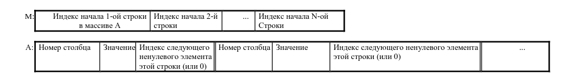

# Отчёт по заданию №7 из курсового проекта по циклу дисциплин «Информатика»

<b>Студент группы:</b> <ins>М80-108Б-22 Кочкожаров Иван Вячеславович, № по списку 25</ins> 

<b>Контакты e-mail:</b> <ins>tegusigaalpa@gmail.com</ins>

<b>Работа выполнена:</b> «10» <ins> июня </ins> <ins>2023</ins> г.

<b>Преподаватель:</b> <ins>асп. каф. 806 Сахарин Никита Александрович</ins>

<b>Входной контроль знаний с оценкой:</b> <ins> 5 </ins>

<b>Отчет сдан</b> «10» <ins>июня</ins> <ins>2023</ins> г., <b>итоговая оценка</b> <ins> 5 </ins>

<b>Подпись преподавателя:</b> ________________

## 1. Тема

Разреженные матрицы

## 2. Цель работы

Составить программу на языке Си с процедурами и/или функциями для обработки прямоугольных разреженных матриц.

## 3. Задание

Программа для обработки прямоугольных разреженных матриц с
элементами целого типов, должна делать следующее:
1. вводить матрицы различного размера, представленные во входном текстовом файле в обычном формате (по строкам),
с одновременным размещением ненулевых элементов в разреженной матрице в соответствии с заданной схемой;
2. печатать введенные матрицы во внутреннем представлении согласно заданной схеме размещения и в обычном
(естественном) виде;
3. выполнять необходимые преобразования разреженных матриц (или вычисления над ними) путем обращения к
соответствующим процедурам и/или функциям;
4. печатает результат преобразования (вычисления) согласно заданной схеме размещения и в обычном виде.'

В процедурах и функциях предусмотреть проверки и печать сообщений в случаях ошибок в задании параметров. Для
отладки использовать матрицы, содержащие 5–10% ненулевых элементов с максимальным числом элементов 100.

**Варианты схемы размещения матрицы:** все матрицы m x n хранятся по строкам, в порядке возрастания индексов
ненулевых элементов.

Цепочка ненулевых элементов в векторе A со строчным индексированием (индексы в массиве M равны 0, если соответствующая строка матрицы содержит только нули)



Индекс, равный нулю, означает отсутствие ненулевых элементов в строке (или в ее остатке).
Если матрицы не изменяются программой, возможна экономия памяти за счет отказа от хранения в массиве А индексов
следующего элемента столбца (когда элементы идут подряд). Вставка и удаление при этом способе возможны, но чересчур
дороги: число перестановок элементов составит O(N) вместо O(1).

**Вариант преобразования:** Найти элемент матрицы, ближайший к заданному значению. Разделить на него элементы строки и столбца, на
пересечении которых он расположен. Если таких элементов несколько, обработать все.

**Вариант физического представления** - на массив.

## 4. Оборудование:

<b>Процессор:</b> AMD Ryzen 5 5600H (12) @ 3.300GHz 

<b>ОП:</b> 16gb

<b>SSD:</b> 512 Gb SSD

<b>Монитор:</b> 15.6" - 1920*1080

<b>Графика:</b> Radeon RX Vega 7

## 5. Программное обеспечение:

<b>Операционная система семейства:</b> Gentoo Linux x86_64

<b>Интерпретатор команд:</b> fish, version 3.4.0

<b>Система программирования:</b> -

<b>Редактор текстов:</b> Visual Studio Code версия 1.76.0

## 6. Идея, метод, алгоритм решения:

Элементы строк образуют односвязные списки, все они размещаются в одном массиве, который динамически расширяется. Фактически, удаление элементов не происходит, удаленный элемент встает в отдельный связный список "пустых элементов" - на их места в первую очередь будут записываться новые. Таким образом, эта реализация оптимизирована для вставки. Она медленно ищет, но просматривает не более, чем все элементы одной строки.

## 7. Сценарий выполнения работы:

```
ivan@asus-vivobook ~/c/f/cp7 (master)> cat t3.txt 
3 5
3  18  0  0  1
9 -9  0  25  28
0  8  0  -9  2
ivan@asus-vivobook ~/c/f/cp7 (master)> ./main < t3.txt 
size1 = 2, size2 = 3
M = [1][3]
A = [-1 8 -1][1 3 2][2 7 4][0 1 -1][0 2 -1][-1 -66 0][-1 -66 5][-1 -88 6]
        2       3       7
        1       0       0
Modified matrix:
size1 = 3, size2 = 2
M = [1][3][-1]
A = [-1 8 -1][1 3 4][-1 7 7][0 1 -1][0 2 -1][-1 -66 0][-1 -66 5][-1 -88 6]
        2       3
        1       0
        0       0
Input matrix:
size1 = 3, size2 = 5
M = [0][3][7]
A = [0 3 1][1 18 2][4 1 -1][0 9 4][1 -9 5][3 25 6][4 28 -1][1 8 8][3 -9 9][4 2 -1]
        3       18      0       0       1
        9       -9      0       25      28
        0       8       0       -9      2
Cross Divide:
        3       -2      0       0       1
        -1      -9      0       0       -3
        0       0       0       -9      0
```

## 8. Распечатка протокола

```
ivan@asus-vivobook ~/c/f/cp7 (master)> make clean all
rm -rf *.o main
gcc -Wall -Werror -Wextra -Wfatal-errors -Wpedantic -pedantic-errors -std=c18 -c main.c -o main.o
gcc -Wall -Werror -Wextra -Wfatal-errors -Wpedantic -pedantic-errors -std=c18 -c matrix.c -o matrix.o
gcc  main.o matrix.o  -o main
```

## 9. Замечания автора по существу работы 

### Защита

<b>Контест (Div. 3): </b>
<b>[1](https://codeforces.com/contest/1840/submission/208748973)</b>
<b>[2](https://codeforces.com/contest/1840/submission/208770817)</b>

<b>[Дорешка](https://codeforces.com/contest/1840/submission/209169585)</b>

## 10.Вывод работы:

После выполнения работы, были получены навыки устранения утечек памяти с помощью Valgrind, а так же эффективного представления разреженных матриц в памяти.

<b>Подпись студента:</b> ________________
